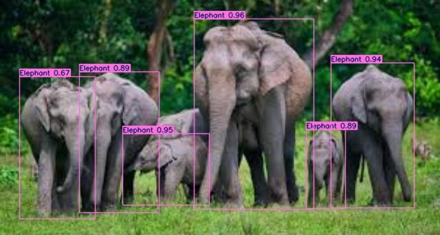

# 🐾 Animal Detection using YOLOv8

This project implements real-time animal detection in videos using YOLOv11m. It demonstrates how to fine-tune YOLOv8 on a custom animal dataset and run inference on test videos.

## 📁 Project Structure

- `AnimalDetection.ipynb`: Main notebook containing training and inference steps.
- `Test result/`: Folder containing sample results from test images.
## 📸 Sample Detection Results

| Original Test Image | YOLOv11n Detection Output |
|---------------------|---------------------------|
|  |  |
|  |  |


## 🚀 Features

- YOLOv11m-based animal detector
- Trained on a custom dataset
- Real-time image and video inference support
- Configurable confidence threshold, line width, and save options

## 📦 Installation

### 1. Clone the repository
```bash
git clone https://github.com/Maruf-004/AnimalDetection.git
cd AnimalDetection

#Download YOLOv11 (if needed)

!pip install ultralytics

#Training is done using YOLOv11m:
!yolo task=detect mode=train model=yolov11m.pt data=custom_data.yaml epochs=50 imgsz=640
```

**🔧 Technologies Used**
YOLOv11n (Ultralytics)

Python 3.x

OpenCV for image and video processing

Google Colab for training and testing

**Author**
Md. Maruf

📧 maruf.mte.17@gmail.com

🔗 [Google Site](https://sites.google.com/view/maruf004)
